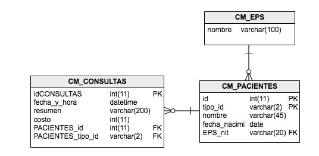

### Escuela Colombiana de Ingeniería
### Procesos de desarrollo de Software - PDSW
#### Tecnologías de persistencia - Frameworks de Persistencia - Introducción a MyBatis


En este laboratorio, se experimentará con el framework MyBATIS para interactuar con un modelo de base de datos y hacer persistencia del modelo de Pacientes-Consultas trabajado hasta ahora. La base de datos que se utilizará tiene los siguientes parámetros:

	host: desarrollo.is.escuelaing.edu.co
	puerto: 3306
	usuario: bdprueba
	pwd: bdprueba
	base de datos: bdprueba

Y corresponde al siguiente modelo:




## Parte I


1. Ubique el archivo de configuración de MyBATIS (mybatis-config.xml). Éste está en la ruta donde normalmente se ubican los archivos de configuración de aplicaciones montadas en Maven (src/main/resources). Edítelo y agregue en éste, después de la sección &lt;settings&gt; los siguientes 'typeAliases':

	```xml
    <typeAliases>
        <typeAlias type='edu.eci.pdsw.samples.entities.Paciente' alias='Paciente'/>
        <typeAlias type='edu.eci.pdsw.samples.entities.Consulta' alias='Consulta'/>
        <typeAlias type='edu.eci.pdsw.samples.entities.Eps' alias='Eps'/>
    </typeAliases>
	```


3. Lo primero que va a hacer es configurar un 'mapper' que permita que el framework reconstruya todos los objetos Paciente con sus detalles (EPS y Citas realizadas). Para hacer más eficiente la reconstrucción, la misma se realizará a partir de una sola sentencia SQL que relaciona los Pacientes, sus Consultas y su EPS. Ejecute esta sentencia en un cliente SQL (en las estaciones Linux está instalado EMMA), y revise qué nombre se le está asignando a cada columna del resultado:

	```sql
        select
        
        p.id,
        p.tipo_id,
        p.nombre,
        p.fecha_nacimiento,

	
        e.nombre,
        e.nit,

        c.idCONSULTAS,
        c.fecha_y_hora,
        c.resumen,
        c.costo
  
        
        FROM  CM_PACIENTES as p left join CM_CONSULTAS as c on p.id=c.PACIENTES_id left join CM_EPS as e on p.eps_nit=e.nit
	```


4. Abra el archivo XML en el cual se definirán los parámetros para que MyBatis genere el 'mapper' de Paciente (PacienteMapper.xml). Ahora, mapee un elemento de tipo \<select> al método 'loadPacientes':

	```xml
   <select parameterType="map" id="loadPacientes" resultMap="PacienteResult">
   			SENTENCIA SQL
	</select>
	```


5. Note que el mapeo hecho anteriormente, se indica que los detalles de a qué atributo corresponde cada columna del resultado de la consulta están en un 'resultMap' llamado "PacienteResult". En el XML del mapeo agregue un elemento de tipo &lt;resultMap&gt;, en el cual se defina, para una entidad(clase) en particular, a qué columnas estarán asociadas cada una de sus propiedades (recuerde que propiedad != atributo). La siguiente es un ejemplo del uso de la sintaxis de &lt;resultMap&gt; para la clase Maestro, la cual tiene una relación 'uno a muchos' con la clase DetalleUno y una relación 'uno a uno' con la clase DetalleDos, y donde -a la vez-, DetalleUno tiene una relación 'uno-a-uno- con DetalleDos:

	```xml
    <resultMap type='Maestro' id='MaestroResult'>
        <id property='propiedad1' column='COLUMNA1'/>
        <result property='propiedad2' column='COLUMNA2'/>
        <result property='propiedad3' column='COLUMNA3'/>  
        <collection property='propiedad4' ofType='DetalleUno'></collection>
		<association property="propiedad5" javaType="DetalleDos"></association>      
    </resultMap>

    <resultMap type='DetalleUno' id='DetalleResult'>
        <id property='propiedadx' column='COLUMNAX'/>
        <result property='propiedady' column='COLUMNAY'/>
        <result property='propiedadz' column='COLUMNAZ'/> 
		 <association property="propiedadw" javaType="DetalleDos"></association>      
    </resultMap>
    
    <resultMap type='DetalleDos' id='DetalleResult'>
        <id property='propiedadr' column='COLUMNAR'/>
        <result property='propiedads' column='COLUMNAS'/>
        <result property='propiedadt' column='COLUMNAT'/>        
    </resultMap>

	```

	Como observa, Para cada propiedad de la clase se agregará un elemento de tipo &lt;result&gt;, el cual, en la propiedad 'property' indicará el nombre de la propiedad, y en la columna 'column' indicará el nombre de la columna de su tabla correspondiente (en la que se hará persistente). En caso de que la columna sea una llave primaria, en lugar de 'result' se usará un elemento de tipo 'id'. Cuando la clase tiene una relación de composición con otra, se agrega un elemento de tipo &lt;association&gt;.Finalmente, observe que si la clase tiene un atributo de tipo colección (List, Set, etc), se agregará un elemento de tipo &lt;collection&gt;, indicando (en la propiedad 'ofType') de qué tipo son los elementos de la colección. En cuanto al indentificador del 'resultMap', como convención se suele utilizar el nombre del tipo de dato concatenado con 'Result' como sufijo.
	
	Teniendo en cuenta lo anterior, haga tres 'resultMap': uno para la clase Paciente, otro para la clase Eps, y otro para la clase Consulta.


7. Si intenta utilizar el 'mapper' tal como está hasta ahora, se puede presentar un problema: qué pasa si las tablas a las que se les hace JOIN tienen nombres de columnas iguales?... Con esto MyBatis no tendría manera de saber a qué atributos corresponde cada una de las columnas. Para resolver esto, si usted hace un query que haga JOIN entre dos o más tablas, siempre ponga un 'alias' con un prefijo el query. Por ejemplo, si se tiene

	```sql	
	select ma.propiedad1, det.propiedad1 ....
	```	

	Se debería cambiar a:

	```sql		
	select ma.propiedad1, det.propiedad1 as detalle_propiedad1
	```

	Y posteriormente, en la 'colección' o en la 'asociación' correspondiente en el 'resultMap', indicar que las propiedades asociadas a ésta serán aquellas que tengan un determinado prefijo:


	```xml
    <resultMap type='Maestro' id='MaestroResult'>
        <id property='propiedad1' column='COLUMNA1'/>
        <result property='propiedad2' column='COLUMNA2'/>
        <result property='propiedad3' column='COLUMNA3'/>        
        <collection property='propiedad4' ofType='Detalle' columnPrefix='detalle_'></collection>
    </resultMap>
	```
	Haga los ajustes necesarios en la consulta y en los 'resultMap' para que no haya inconsistencias de nombres.


8. Use el programa de prueba suministrado (MyBatisExample) para probar cómo a través del 'mapper' generado por MyBatis, se pueden consultar TODOS los Pacientes. 

	```java	
	...
	SqlSessionFactory sessionfact = getSqlSessionFactory();
	SqlSession sqlss = sessionfact.openSession();
	PacienteMapper pmapper=sqlss.getMapper(PacienteMapper.class);
	
	List<Paciente> pacientes=pmapper.loadPacientes();

	//imprimir contenido de la lista

	...
	```

9. Configure en el XML correspondiente, la operación loadPacienteById del 'mapper' PacienteMapper.

	En este caso, a diferencia del método anterior (cargar todos), el método asociado al 'mapper' tiene parámetros que se deben usar en la sentencia SQL. Es decir, los parámetros 'id' y 'tipoid' de  _public Paciente loadPacienteById(int id,String tipoid);_ se debe usar en el WHERE de su correspondiente sentencia SQL. Para hacer esto tenga en cuenta:

	* Agregue la anotación @Param a dicho parámetro, asociando a ésta el nombre con el que se referirá en la sentencia SQL:

	```java
		public Paciente getPaciente(@Param("idp") int id,@Param("tipoidp") String tipoid);
	```

	* Al XML (\<select>, \<insert>, etc) asociado al método del mapper, agregue la propiedad _parameterType="map"_ .
	* Una vez hecho esto, podrá hacer referencia dentro de la sentencia SQL a estos parámetro a través de: #{idp} e #{tipoidp}

2. Verifique el funcionamiento haciendo una consulta a través del 'mapper' desde MyBatisExample.

## Parte II

Ahora, va a asociar consultas SQL a las dos operaciones restantes de la interfaz de PacienteMapper: insertarPaciente e insertarConsulta. El esquema es similar al anterior, salvo que en lugar de usar un elemento de tipo &lt;select&gt; se usará uno de tipo &lt;insert&gt;. 

1. Implemente el &lt;insert&gt; para 'insertPaciente', haciendo referencia a los parámetros recibidos por el método de la interfaz (usando #{}):

	```xml
    <insert id="insertPaciente">
		COMPLETAR
    </insert>
	```

2. Implemente el &lt;insert&gt; para 'insertConsulta', haciendo referencia a los parámetros recibidos por el método de la interfaz (usando #{}). En este caso, dado CONSULTAS tiene una llave autogenerada, se debe agregar la propiedad 'useGeneratedKeys' en "true", y la propiedad "keyProperty" asociándole el atributo del objeto en el cual se almacenará la llave primaria generada. Por ejemplo, si el parámetro Consulta se declaró como "con":   

	```java
    public void insertConsulta(@Param("con") Consulta con,@Param("idp") int idPaciente,@Param("tipoidp") String tipoid,@Param("costoc") int costoconsulta);
	```

	La propiedad 'keyProperty' tendrá como valor "con.id":
	
	```xml
    <insert id="insertConsulta" useGeneratedKeys="true" keyProperty="con.id">
    	COMPLETAR
    </insert>
	```
    
3. Usando las dos operaciones del mapper (que ya quedaron configuradas), implemente el método 'registrarNuevoPaciente', el cual, como lo indica su especificación, debe registrar un nuevo paciente y sus consultas relacionadas. Recuerde que en este caso debe, a partir del objeto recibido, insertar primero el paciente, y luego las consultas a través de las operaciones del mapper creado anteriormente.
En este caso tenga en cuenta que como la operación es una transacción con varias INSERCIONES, es necesario hacer 'commit' al final de la misma:

	```java	
	...
	SqlSessionFactory sessionfact = getSqlSessionFactory();
	SqlSession sqlss = sessionfact.openSession();
	PacienteMapper pmapper=sqlss.getMapper(PacienteMapper.class);
	
	//realizar las operaciones
	//...

	//hacer commit
	sqlSession.commit();	
	
	...
	```


    